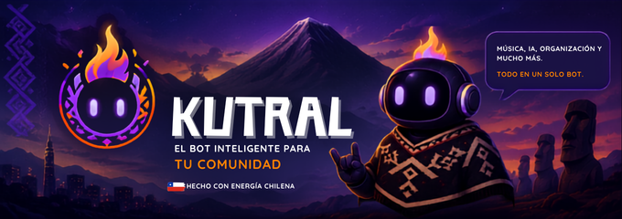
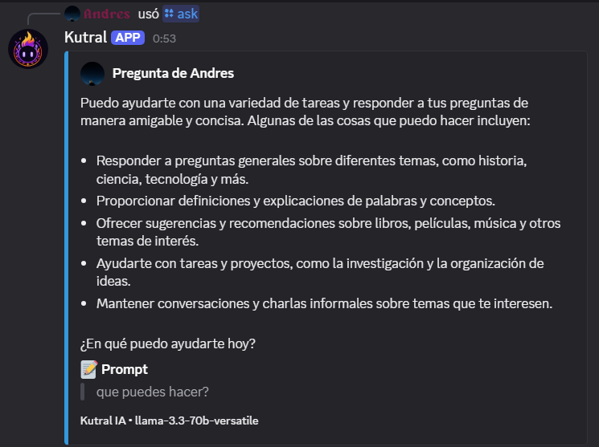
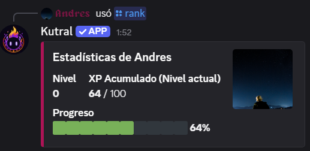
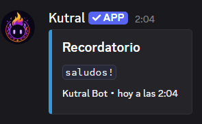
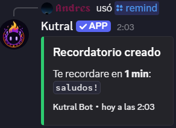

<p align="center">
  
</p>

<h1 align="center">
  <br>
  Kutral Bot 🔥
</h1>

<p align="center">
  Un bot de Discord multifuncional de nueva generación construido con Python. Combinando <b>Inteligencia Artificial Autónoma (Tool Calling)</b>, reproducción de música nativa y herramientas de administración en un solo lugar. Más que un bot, es tu compita en el servidor.
</p>

<p align="center">
  <a href="https://discord.com/oauth2/authorize?client_id=1531107387342327838&permissions=8&integration_type=0&scope=bot+applications.commands">
    
  </a>
</p>

## ✨ Características Épicas

- 🧠 **Autonomía Total (Tool Calling):** La IA (potenciada por Llama 3) no solo habla, **¡actúa!**. Entiende el contexto y puede usar herramientas internas por sí sola. Si le pides *"pon algo de Jonas Sanche"*, ella buscará la canción, se conectará al canal de voz y la reproducirá mientras te responde.
- 🛡️ **Guardaespaldas IA Personal:** Kutral reconoce quién es su dueño. Si tú se lo ordenas, la IA tiene autorización para usar herramientas de moderación y banear, expulsar o silenciar usuarios rebeldes. Si alguien más se lo pide, la IA se rehusará estoicamente.
- 🇨🇱 **Personalidad Única:** Programado para ser de barrio. Kutral te saluda con modismos chilenos ("wena mi rey", "wena compita"), deduce el género a través de los nombres para personalizar el trato, da épicas bienvenidas a servidores nuevos y puede buscar y etiquetar/mencionar a los usuarios si se lo pides.
- 🎵 **Sistema de Música Avanzado:** Audio sin interrupciones desde YouTube (Soporte E2EE/DAVE de Discord) con resolutor ultrarrápido vía `ytmusicapi` para ignorar videos bloqueados.
- 🏆 **Sistema de Niveles (Experiencia):** Recompensa a tus usuarios por interactuar. Incluye comando `/rank` con barra de progreso visual, `/leaderboard` competitivo y enfriamiento anti-spam.
- 📝 **Asistente Personal (Owner Only):** Comandos privados de notas, tareas y recordatorios que solo el dueño del bot puede utilizar.

## 🖼️ Vistazo Rápido

<p align="center">
  
  
  <br>
  
  
</p>

## 🛠️ Stack Tecnológico

- **Python 3.10+**
- **[discord.py](https://github.com/Rapptz/discord.py)** - Interacción nativa con la API de Discord.
- **[yt-dlp](https://github.com/yt-dlp/yt-dlp) & [ytmusicapi](https://ytmusicapi.readthedocs.io/)** - Búsquedas a la velocidad de la luz y manejo de streams.
- **[Groq SDK](https://console.groq.com/docs/quickstart)** - Motor de Inteligencia Artificial hiper-rápido (Llama-3).
- **SQLite (`aiosqlite`)** - Persistencia de datos asíncrona y robusta.

## 🚀 Requisitos Previos

Antes de instalar a Kutral, asegúrate de tener en tu sistema:
- Python 3.10 o superior.
- [Git](https://git-scm.com/).
- [FFmpeg](https://ffmpeg.org/download.html) (Añadido a tus variables de entorno para que el módulo de música despliegue su magia).

## ⚙️ Instalación

1. Clona este repositorio y entra a la carpeta:
   ```bash
   git clone https://github.com/AAMoralesC/Kutral.git
   cd Kutral
   ```

2. Instala las dependencias necesarias:
   ```bash
   python -m pip install -r requirements.txt
   ```
   *Nota: El bot requiere las librerías de voz oficiales de Discord para su correcto funcionamiento (`discord.py[voice]`, `PyNaCl`).*

3. Configura el alma de Kutral. Renombra el archivo `.env.example` a `.env` y completa los datos:
   ```env
   # Tokens principales
   DISCORD_TOKEN=tu_token_de_discord_aqui
   OWNER_ID=tu_id_de_usuario_en_discord
   GROQ_API_KEY=tu_api_key_de_groq
   ```

## 💻 Uso

Para encender a Kutral, simplemente ejecuta:

```bash
python main.py
```

Al arrancar, la consola se iluminará mostrando la carga de cada módulo. ¡Kutral estará listo en Discord para conversar contigo, moderar tu servidor y poner tu música favorita!

## 📁 Estructura del Código

```text
KutralDs/
├── cogs/                 # Módulos independientes y conectables
│   ├── ai_chat.py        # Lógica de Groq, Tool Calling y personalidad
│   ├── levels.py         # Sistema de XP y Leaderboards
│   ├── moderation.py     # Comandos nativos de administración
│   ├── music.py          # Lógica de streaming y colas de audio
│   └── owner.py          # Base de datos privada del creador
├── data/                 # Base de datos SQLite
├── utils/                # Helpers y generación de interfaces (embeds)
├── config.py             # Carga de entorno centralizada
└── main.py               # Entrypoint y setup_hook
```

## 📄 Licencia

Este proyecto es abierto y libre. Siéntete libre de clonarlo, hacer un fork y convertir a Kutral en la chispa que le falta a tu servidor.
